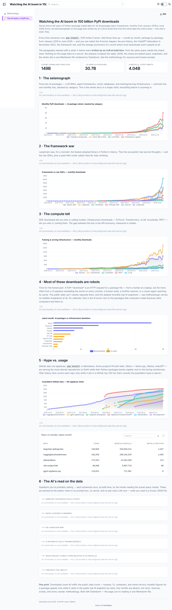

# Watching the AI boom in 150 billion PyPI downloads

**A dashboard that writes its own analysis — baked to static files, no backend, no
per-view LLM cost.**

**Live site:** https://ai-boom.dashdown.ai/



## The story

Every `pip install` leaves a line in PyPI's logs. Replay those logs monthly from
January 2019 to today for 42 AI packages — LLM SDKs, agent frameworks, vector
databases, training/serving infra — and you can watch the AI boom happen:

- **The seismograph.** The cohort idles at ~600k installs/month in 2019, sits at
  36M the month before ChatGPT ships, and ends at **4 billion installs a month**.
- **The framework war.** LangChain's near-vertical 2023 rise — and the punchline
  that **LiteLLM**, a router most people couldn't name, ends the series ahead of
  both LangChain *and* the OpenAI SDK at 633M installs/month (a lead built almost
  entirely in the final quarter of the data — the bots caveat in section 4 applies).
- **The compute tell.** API-client installs vs. torch/vllm installs: the API
  economy, measured in downloads.
- **Most of these downloads are robots.** boto3 does 3.5B downloads/month; nobody
  typed that. The dashboard says out loud what download counts actually measure.
- **Hype vs. usage.** llama.cpp: 119k stars, 711k monthly installs of its Python
  binding. LangChain: fewer stars, 330M installs. Applause ≠ attendance.

## How it's built (the part for HN)

The entire dashboard is **one Markdown file** ([`pages/index.md`](pages/index.md))
rendered by [Dashdown](https://github.com/DirendAI/dashdown): SQL blocks run on an
embedded DuckDB over two committed Parquet files, `<LineChart>` tags draw them, and
the narration is the interesting bit:

- Every ✦-marked paragraph is an **`<Ask inline>`** block — an author-pinned
  question answered by an LLM (`mistral-medium-latest`) **once, at build time**,
  from the same query results the charts draw. The answers are frozen into
  `dist/_dashdown/data/_ask/*.json`.
- Charts carry **`explain`** — a build-time-baked annotation layer that marks the
  inflection points it cites.
- There is **no chat box, no server, no runtime LLM call**. Readers can't prompt
  it; viewing the page costs $0. The one-time build costs a few cents of Mistral
  tokens — and the site builds fine without a key (the AI blocks degrade to a
  muted notice).

```
pages/index.md      ← the whole article: prose + SQL + <Ask>/<LineChart> tags
data/*.parquet      ← ~20 KB of pre-aggregated real data (see below)
dashdown build      → dist/ = plain static files → Cloudflare Pages
```

## The data is real

- **PyPI downloads:** replayed from the git history of
  [hugovk/top-pypi-packages](https://github.com/hugovk/top-pypi-packages)
  (monthly top-N snapshots of PyPI's public download stats since 2019).
- **GitHub stars:** replayed from the git history of
  [EvanLi/Github-Ranking](https://github.com/EvanLi/Github-Ranking)
  (daily top-100 star counts since 2018).

`scripts/` contains the reproducible fetchers plus the canonical full-resolution
ClickHouse queries. The caveats (bots, mirrors, top-N censoring) are documented on
the [methodology page](https://ai-boom.dashdown.ai/methodology/) —
and narrated, honestly, in section 4 of the dashboard itself.

## Run it yourself

```bash
pip install 'dashdown-md[mistral,pdf]'
dashdown serve .                                # dev server on :8000
MISTRAL_API_KEY=… dashdown build . --out dist   # static export, AI answers baked
python scripts/fetch_pypi_downloads.py          # optional: refresh the data
python scripts/fetch_github_stars.py
```

Deployment is a stock GitHub Actions workflow
([`.github/workflows/deploy.yml`](.github/workflows/deploy.yml)): build with the
`MISTRAL_API_KEY` repo secret, then `wrangler pages deploy dist` to Cloudflare
Pages, served at [ai-boom.dashdown.ai](https://ai-boom.dashdown.ai/).
